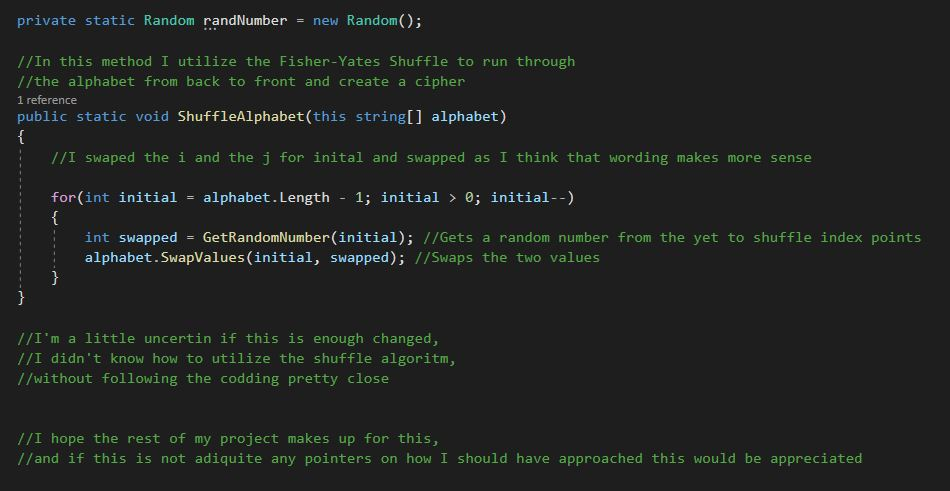

# The Fisher-Yates Shuffle
###### I found this week to be more understanding than the last, and I felt like I was starting to get a better grasp on the expectation of algorithms.

###### For Fisher-Yates specifically , I found positives and negatives to both of the reviewed versions:

###### Though I don't love the for loop conditions of this one, formating it in such a way makes the rest of the coding process smooth. Not setting int i = 0, and instead utilizing the lenth of the array, makes the swap very smooth

```
-- To shuffle an array a of n elements (indices 0..n-1):
for i from n−1 downto 1 do
     j ← random integer such that 0 ≤ j ≤ i
     exchange a[j] and a[i]
```

###### While for this one, though I love working with int i = 0 in my for loops it makes the rest of the code less than ideal.
```
-- To shuffle an array a of n elements (indices 0..n-1):
for i from 0 to n−2 do
     j ← random integer such that i ≤ j < n
     exchange a[i] and a[j]
```
# Cipher using Fisher-Yates

###### For this assignment I decided to make a cipher, using the above explained method, it shuffles the alphabet, and then prints out both the un-shuffled and shuffled versions

###### Output Example:
```
a b c d e f g h i j k l m n o p q r s t u v w x y z
v g z l a u r i x k h j y c n o b e m f p s t q d w

```
###### Code Example:

